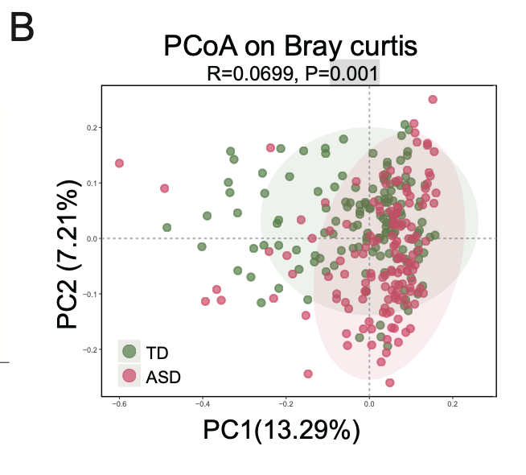
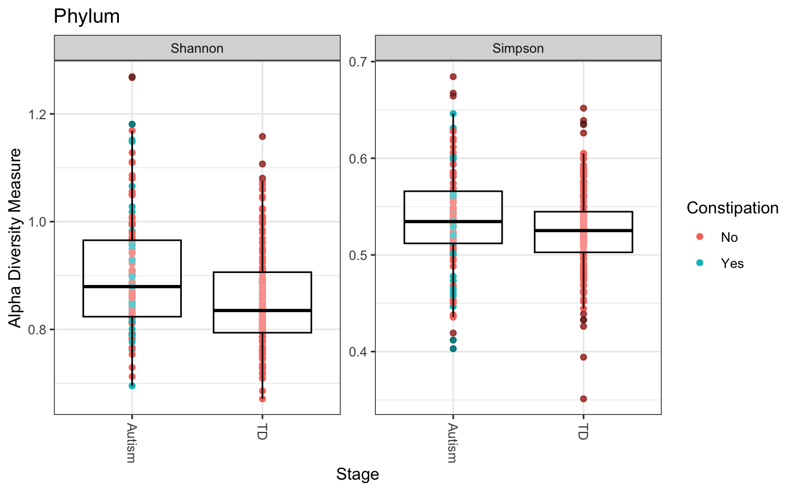
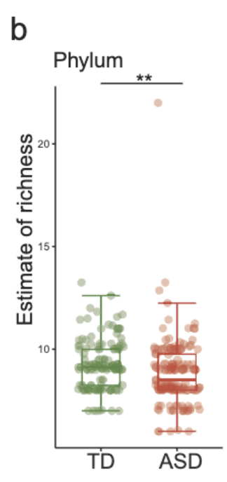
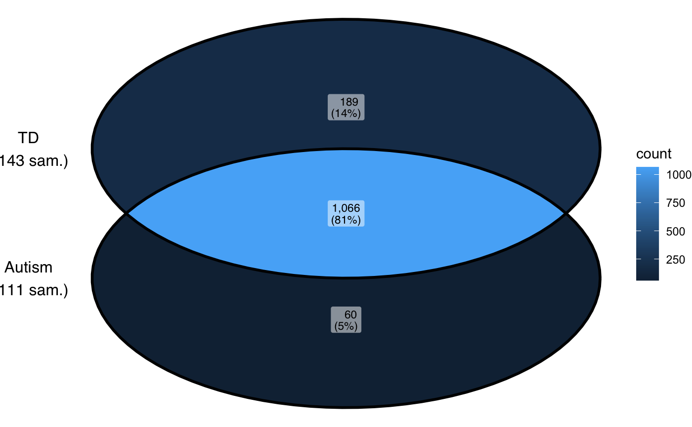
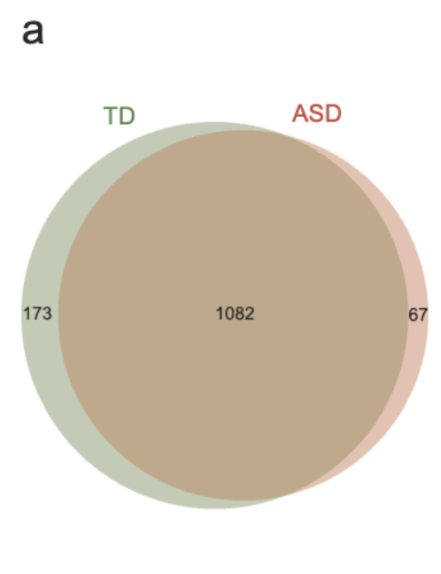
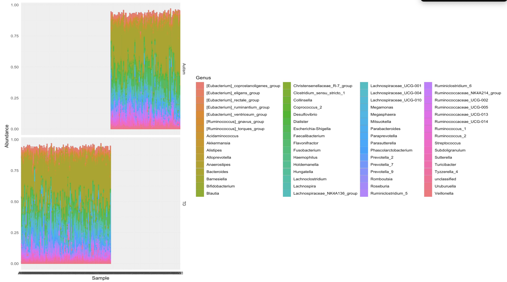
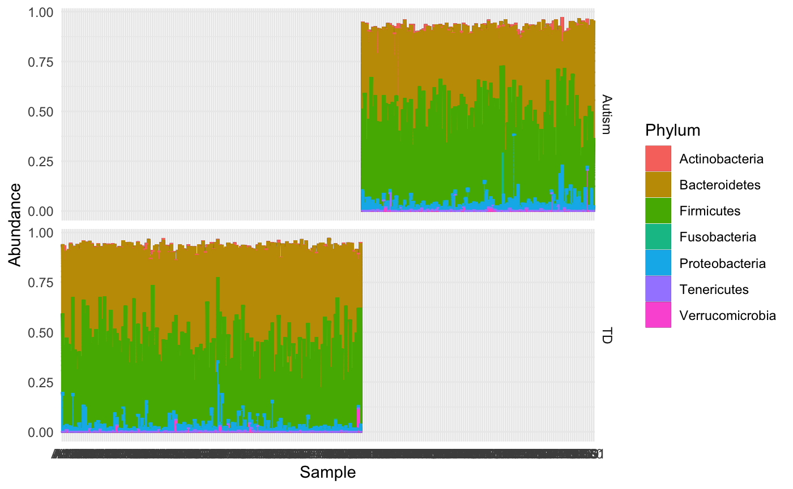
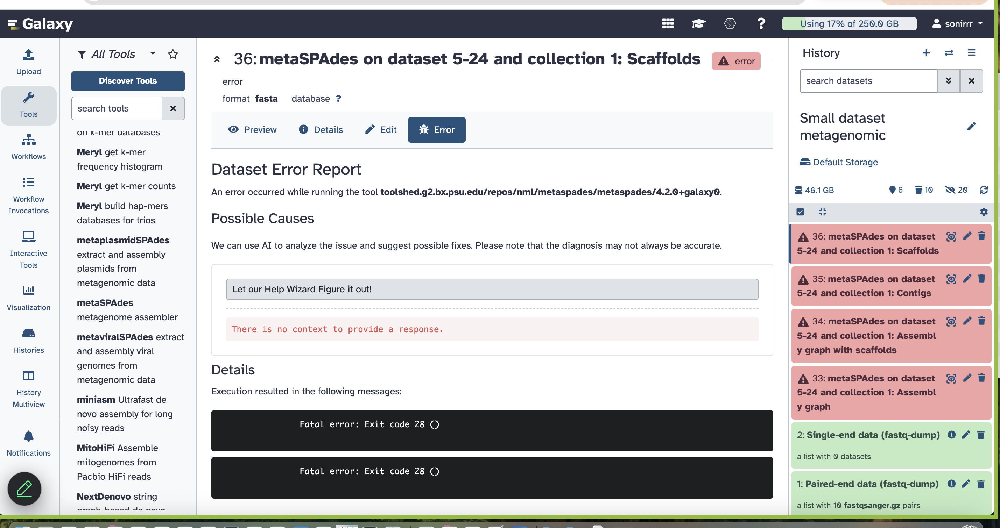
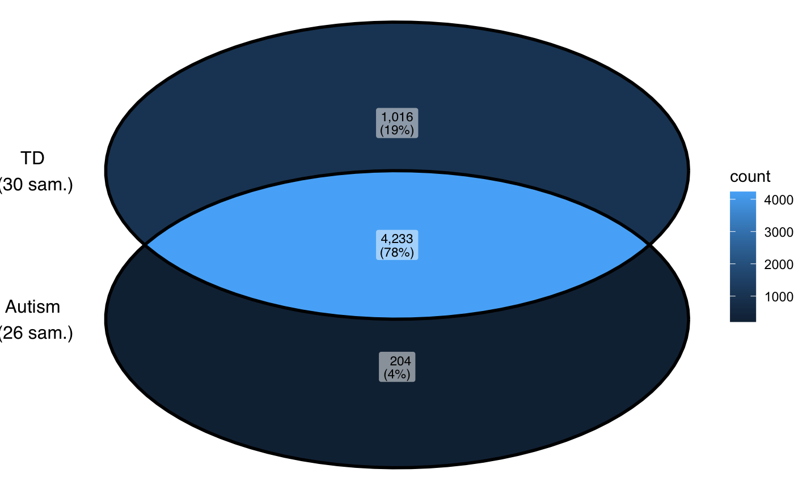

# Check-In 2: New progress since last submission

- Generating figures using 16S asv table (both recreating figures from paper and creating our own)
- All code in "Figure_Attempt.Rmd" along with all rendered figures

| Reproduction | Original Figure |
|--------|---------|
|  |  |
|  |  |
|  |  |

- See R notebook for full analysis of figure comparisons
- Our figures generally reproduce the paper's results
- Given that we used orthogonal approaches, this suggests that a) our analysis is on-target and b) the paper's conclusions are generally supported by the data
- We believe that differences between our figures and the originals are due to differences in data analysis but
- We do not have enough information from their methods/documentation to replicate their analysis 1:1 (our approximations are based on the final figures and our assumptions)

## Metagenomic analysis
- Processing using metaSPADES in Galaxy browser
- Running analysis with subset (10 samples)
- Paired end with auto-kmer detection, samples do not belong to the same library
- After a full day running on the browser, we got this error and we are not sure how to proceed from here
- 
- In the meantime, recreating figures based on data provided with paper (eventually will replace with our own analysis)

| 16S | Metagenomic |
|--------|---------|
|  |  |

### Initial observations 
- Number of shared taxonomic differences is different but trend is the same
- Genus level bar charts are hard to intepret (too many genera), working on phylum level bar charts for better comparison
  
## Still to be done (metagenomic analysis)
- Fix error with the Galaxy browser and run metaSPADES on subset of samples
- Script to match sample names to SRA accession numbers (I did this by eye for the subset but we cannot do this for the entire dataset, must use accession numbers to pull data for metaSPADES)
- metaSPADES analysis on full dataset (cannot do this on the Galaxy browser, considering Rockfish but looking for suggestions on where/how to run this)
- Use full metagenomic data for figures
- Compare to 16S and original 

## Response to feedback
- Using megaSPADES to assemble metagenomic reads as discussed in class
- The metadata table was taken directly from the paper (we did not create it) so we did not feel it was appropriate to upload to our github
- Github repo belongs to Rishi and his git push is broken :( the TAs were not able to fix this in office hours and he is stuck uploading with the web browser
- Because of this error, he cannot make the folders/organize the github right now :(( looking for help on how to fix this bc it is also a problem with the quant bio hw uploads
